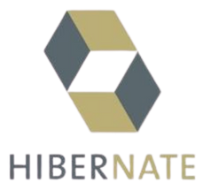

    

## 🧭 Guia de Navegação (Índice)

- **[💻 Sobre o Projeto](#sobre-o-projeto)**
- **[⚙️ Funcionalidades](#funcionalidades)**
- **[🛠️ Tecnologias](#tecnologias)**
- **[👤 Sobre o Desenvolvedor](#sobre-o-desenvolvedor)**
- **[📚 Recursos Adicionais](#recursos-adicionais)**
- **[📜 Licença](#licenca)**

## Voll.med

## 💻 Sobre o Projeto 

Voll.med é uma clínica médica fictícia que necessita de um sistema para gestão de consultas médicas. A aplicação foi desenvolvida como uma API REST, permitindo o gerenciamento completo de médicos, pacientes e consultas, seguindo boas práticas de arquitetura e desenvolvimento com Spring Boot.

## ⚙️ Funcionalidades 

- ✅ Cadastro, listagem, atualização e exclusão de médicos (CRUD)
- ✅ Cadastro, listagem, atualização e exclusão de pacientes (CRUD)
- ✅ Agendamento de consultas com regras de negócio
- ✅ Cancelamento de consultas

## 🛠️ Tecnologias 

As seguintes tecnologias foram utilizadas no desenvolvimento da API Rest do projeto:

<table align="center">
  <thead>
    <tr>
      <th>Logo</th>
      <th>Descrição</th>
    </tr>
  </thead>
  <tbody>
    <tr>
      <td align="center">
        
      </td>
      <td>Linguagem principal utilizada na API</td>
    </tr>
    <tr>
      <td align="center">
        
      </td>
      <td>Framework para criação de aplicações Java modernas</td>
    </tr>
    <tr>
      <td align="center">
        
      </td>
      <td>Gerenciamento de dependências e build</td>
    </tr>
    <tr>
      <td align="center">
        
      </td>
      <td>Sistema gerenciador de banco de dados relacional</td>
    </tr>
    <tr>
      <td align="center">
        
      </td>
      <td>Mapeamento objeto-relacional (ORM)</td>
    </tr>
    <tr>
      <td align="center">
        
      </td>
      <td>Controle de versionamento de banco de dados</td>
    </tr>
    <tr>
      <td align="center">
        
      </td>
      <td>Redução de código boilerplate em Java</td>
    </tr>
  </tbody>
</table>

## 👤 Sobre o Desenvolvedor 

<table align="center">
  <tr>
    <td align="center">
         
        
        

        <a href="https://github.com/0nF1REy" target="_blank">
          <strong>Alan Ryan</strong>
        </a>
        

        ☕ Peopleware | Tech Enthusiast | Code Slinger ☕
         
        Apaixonado por código limpo, arquitetura escalável e experiências digitais envolventes
        

          Conecte-se comigo:
        

        
        
        
        

    </td>
  </tr>
</table>

---

## 📚 Recursos Adicionais 

- [**Spring Boot**](https://spring.io/projects/spring-boot)
- [**Spring Data JPA**](https://spring.io/projects/spring-data-jpa)
- [**Hibernate ORM**](https://hibernate.org/orm/documentation/)
- [**Flyway**](https://documentation.red-gate.com/fd)
- [**MariaDB**](https://mariadb.com/docs/)
- [**Maven**](https://maven.apache.org/guides/)
- [**Java (OpenJDK)**](https://docs.oracle.com/en/java/)

## 📜 Licença 

Este projeto está sob a **licença MIT**. Consulte o arquivo **[LICENSE](LICENSE)** para obter mais detalhes.

> ℹ️ **Aviso de Licença:** &copy; 2025-2026 Alan Ryan da Silva Domingues. Este projeto está licenciado sob os termos da licença MIT. Isso significa que você pode usá-lo, copiá-lo, modificá-lo e distribuí-lo com liberdade, desde que mantenha os avisos de copyright.

⭐ Se este repositório foi útil para você, considere dar uma estrela!
